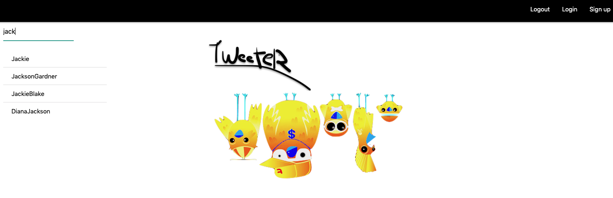
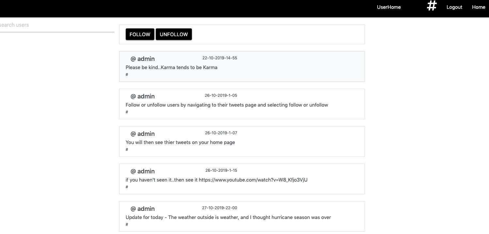
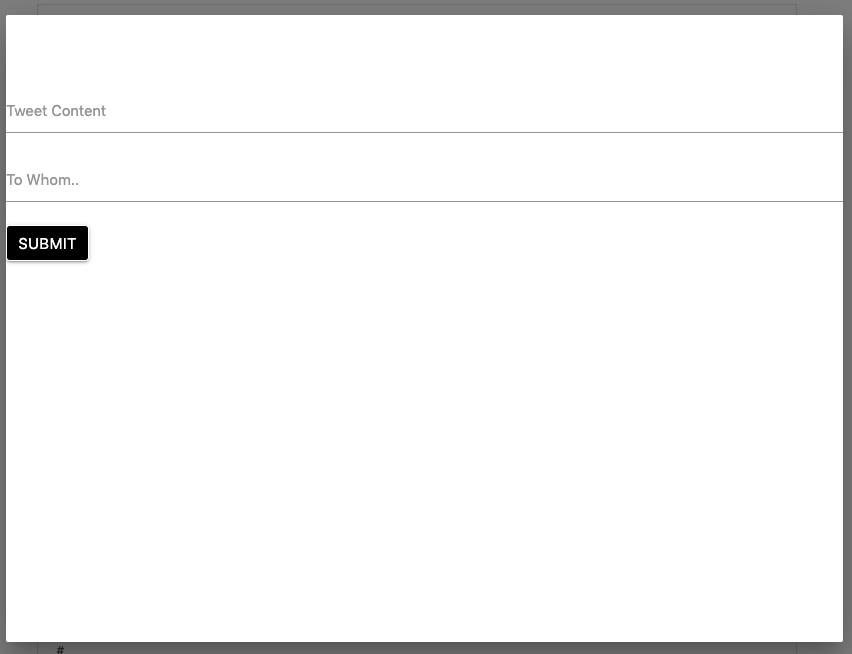

# Tweeter - Twitter clone

https://calm-earth-94528.herokuapp.com/

This is a twitter clone. Users can create a username, then tweet their thoughts to the world. There is no character cap. This program only completes the basic functions. Everything is backend.








# Core
Node, Express, Boostrap, PostgresSQL, mustache (templates), bcrypt (password hashing)

# Development
Nothing too special here. This was a backend project using Bootsrap for styling and Node / Express for the backend. All data is stored in a PostgresSQL database, all passwords are hashed.
As all the various pages are similar - Joe's tweets page is the same as Suzie's page (other than the actual content) so
mustache was used as the template system. I did add a search feature to make the application more usable. The thought process here was -
'What if someone is thinking about using this and wants to see what it's all about. If they can't search for random users to see
what their pages look like, how can they explore the app before signing up?'. A search function was added to the homepage. This uses trigrams to complete
searches in real time. I created a database with over 1,000 users and there are 0 performance issues. I did not limit the # of results returned
as I wanted to demonstrate the function.
  The search simply uses an Ajax request to the backend to return results from the database query.
  
  ```document.addEventListener("DOMContentLoaded", function() {
  const searchBar = document.forms["search_users"].querySelector("input");
  searchBar.addEventListener("keyup", function(e) {
    let term = e.target.value;
    if (term === "") {
      return;
    } else {
      $.ajax({
        url: "/data",
        type: "get",
        data: {
          query: term
        }
      }).then(extractInfo);
      function extractInfo(theInfo) {
        vomUsers = theInfo.map(function(usernames) {
          return `<a href=/user/${usernames.username} class = 'collection-item'>${usernames.username}</a>`;
        });
        document.getElementById("resultsContainer").innerHTML = vomUsers.join("");
      }
    }
  });
});
```


* I originally called this application Word Vomit while in development, hence the 'vomUsers'

You can read about trigrams here - https://www.postgresql.org/docs/9.6/pgtrgm.html

# Known issues
There is a timestamp, I believe it's correct but a little hard to understand: day-month-year-hour-minute. Please note this is in heroku, I do not know where the server is located. The odds of the time matching your local time are small. The tweets are ordered from oldest to newest. This is an obvious oversight. The timestamps were added at the last minute.. we all know how that can go. Although you can add who you are tweeting to, this has 0 affect. It does show who you tweeted to but you cannot view who has tweeted to you, search order or anything of the like.


